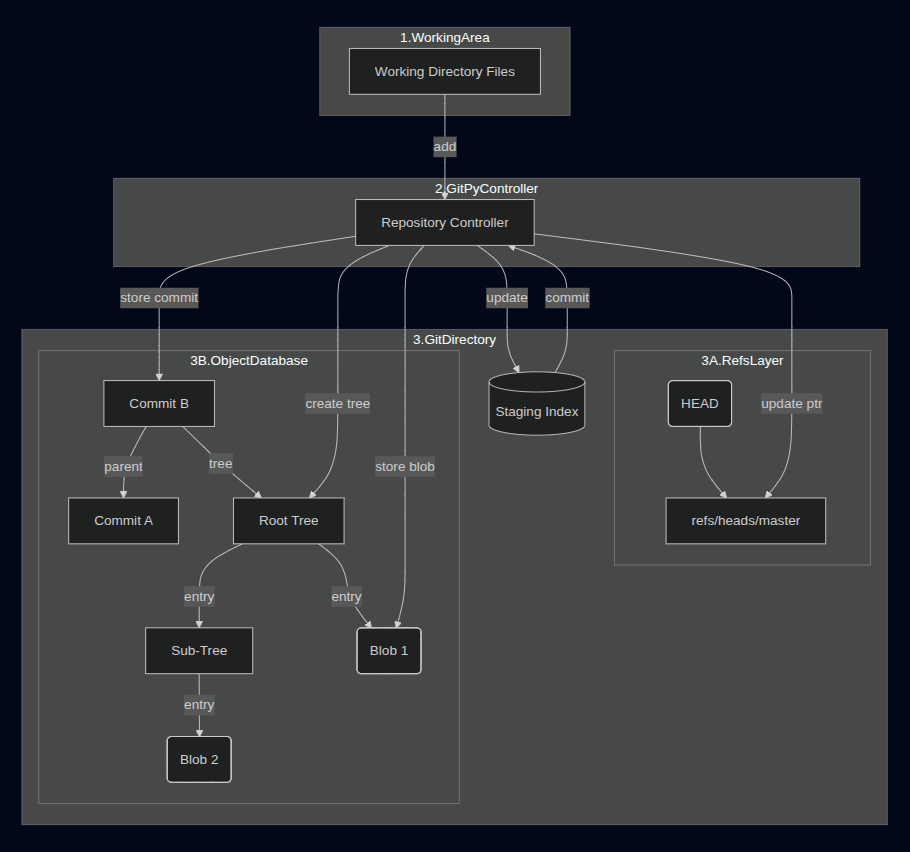

# 🐍 GitPy: A Pythonic Dive into Git Internals


A minimalist, educational implementation of the core Git version control system, built from scratch in pure Python. The goal of this project is to **demystify Git's inner workings** by replicating its essential data structures and command line interface.

---

## ✨ Features

GitPy supports the fundamental, low-level commands necessary to manage repository history:

| Command | Description | Internal Functionality |
| :--- | :--- | :--- |
| `init` | Initializes the repository, creating the custom `.gitpy` folder structure. | Sets up `HEAD`, `refs`, and the empty `index`. |
| `add` | Stages files or directories for the next commit. | Creates **Blob** objects and updates the **Index**. |
| `commit` | Records changes permanently to the history. | Creates **Tree** and **Commit** objects, updating branch **Refs**. |
| `checkout` | Switches branches or restores the working directory to a specific state. | Recursively reads **Tree** objects to restore files. |
| `branch` | Lists, creates, or deletes local branches. | Manipulates pointers in the `.gitpy/refs/heads` directory. |
| `log` | Displays the commit history of the current branch. | Follows the **parent_hashes** back through the **DAG**. |
| `status` | Shows the state of the staging area and working directory. | Compares the working area, Index, and last Commit's Tree. |

---

## 🧠 Why GitPy? (A Technical Deep Dive)

This project is a deep dive into the system design principles that underpin distributed version control. The implementation directly showcases the following concepts:

* **Content-Addressable Storage (CAS):** Implements the object database where file content is hashed using SHA-1 (`hashlib`) and the hash *is* the identifier (the key).
* **The Merkle DAG:** The Commit objects are chained via `parent_hashes`, forming a **Directed Acyclic Graph (DAG)** that ensures the history is immutable and cryptographically verifiable.
* **Object Serialization:** Files are compressed using the standard Python `zlib` library and stored with a custom header, replicating the exact storage format of real Git objects.
* **Recursive Tree Building:** Demonstrates the algorithm required to convert a flat "staging index" into a nested hierarchy of Tree objects for permanent storage.

---
## Architectural Diagram

### 🔑 Key Components & Roles
Here is a one-line explanation for the core Git objects implemented in our Python classes:

* Blob (B1, B2): A Blob is a single, immutable, compressed chunk of file content, named by the SHA-1 hash of its content.
* Tree (T_Root, T_Sub): A Tree is a directory listing that maps filenames to the hashes of Blobs or other Trees.
* Commit (C1, C2): A Commit is a snapshot of the entire repository state, containing metadata (author, message) and pointing to the hash of the single top-level Tree object.
* Staging Index: A temporary file (in our case, a JSON file) that stores the mapping between the file paths in the working directory and the Blob hashes destined for the next commit.
* Refs: Simple files (like refs/heads/master) that store the SHA-1 hash of the most recent Commit in a branch.

### ⚙️ How the Diagram Works
The diagram illustrates two crucial architectural concepts at the heart of Git and our GitPy implementation: the Directed Acyclic Graph (DAG) and the Merkle Tree.

* Workflow & Indexing: The flow begins when the Controller (RepoClass) reads the Working Directory (WD) files via repo.add(). The file content is converted into a Blob, stored in the database, and the path-to-hash mapping is written to the Index.
* Commit & Merkle Tree: When repo.commit() is called, the Controller reads the Index. It executes the recursive logic to convert the flat Index into nested Tree objects (the Merkle Tree). The Root Tree (T_Root) points to all files (Blobs) and sub-directories (Sub-Trees). The Commit (C2) object is then created, which points only to the single hash of the Root Tree, creating an immutable snapshot of the entire project state.
* The DAG (History): The Commit (C2) doesn't just point to a Tree; it also points to its parent commit (C1). This links all commits sequentially, forming the DAG—a linear history that prevents changes from being lost or accidentally overwritten, ensuring full traceability.
* Tracking State (Refs): Finally, the Controller updates the Branch Ref (MasterRef) file to store the hash of the new Commit (C2). This simple file acts as the pointer for the entire branch, telling Git which Commit is currently the head of the branch.

This architecture ensures that every version of the repository is cryptographically verifiable, as any change to a file would change its Blob hash, which would change the Tree hash, which would change the Commit hash.



> 💡 **Pro Tip for VS Code Visualization:**
>
> If you globally change all instances of `.gitpy` to `.git` in your Python code, your repository folder will be recognized by VS Code (and other Git tools) as it uses same compression techniques as official git. This allows you to use Git extensions to visualize the **Commit Graph** and **Branch History** that your project generates!

## 🛠️ Setup and Usage

### Prerequisites

* Python 3.6+

### Installation

Clone the repository:

```bash
git clone https://github.com/TanishqRinjay/git-clone.git
cd gitpy

# Run the program
python main.py init
python main.py add .
python main.py commit -m "Initial commit"
.
.
... other commands
```
